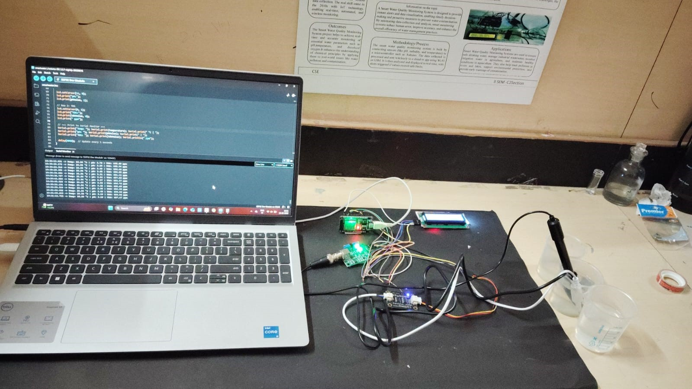

# 💧 Smart Water Quality Monitoring System

This project monitors **Temperature, pH, and TDS levels** in water using an **ESP32 microcontroller**.  
The results are displayed on a **16x2 I2C LCD** and also printed on the Serial Monitor.  

---

## 🛠 Components Used
- ESP32
- DS18B20 Temperature Sensor
- pH Sensor
- TDS Sensor
- 16x2 I2C LCD (I2C module)

---

## ⚡ Features
- Real-time monitoring of **Temperature, pH, and TDS**  
- Data shown on **LCD display + Serial Monitor**  
- Simple and compact design  
- Easy to extend for IoT (cloud integration possible)  

---

## 📂 Project Files
- `1waterquality.ino` → Main Arduino code  
- `images/` → Circuit diagrams & real project photos (optional)  
- `README.md` → Project documentation  

---

## 🚀 How to Run
1. Install **Arduino IDE** and add **ESP32 board support**.  
2. Connect sensors to ESP32:  
   - **DS18B20 (Temperature)** → Pin 4  
   - **pH Sensor** → Pin 34 (Analog)  
   - **TDS Sensor** → Pin 35 (Analog)  
   - **I2C LCD** → SDA & SCL pins of ESP32  
3. Open `1waterquality.ino` in Arduino IDE.  
4. Select **ESP32 Dev Module** from Tools → Board.  
5. Upload the code to ESP32.  
6. View results on LCD and Serial Monitor.  

---

## 🔧 Circuit Diagram
(Add your circuit diagram/photo here)  
```markdown



